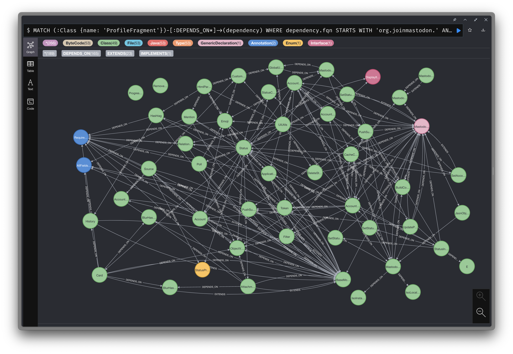

# cardbox

Create JARs from Android projects for jQAssistant.

## Use cases

- Modularization
- Kotlin Multiplatform Mobile (KMM) migration

## Installation

```bash
$ brew install redgreenio/tap/cardbox
```

## Update

```bash
$ brew upgrade cardbox
```

## Usage

Build your Android project and from the project root run,

```bash
$ cardbox pack .
```

After a successful run, you will find the packaged artifacts inside the `$HOME/cardbox/<project>/<git-sha>`
directory.


You can scan these artifacts using [jQAssistant](https://github.com/jQAssistant/jqa-commandline-tool) to perform your
analysis.



## License

```
Copyright (c) 2021-Present, Ragunath Jawahar

Licensed under the Apache License, Version 2.0 (the "License");
you may not use this file except in compliance with the License.
You may obtain a copy of the License at

   http://www.apache.org/licenses/LICENSE-2.0

Unless required by applicable law or agreed to in writing, software
distributed under the License is distributed on an "AS IS" BASIS,
WITHOUT WARRANTIES OR CONDITIONS OF ANY KIND, either express or implied.
See the License for the specific language governing permissions and
limitations under the License.
```
